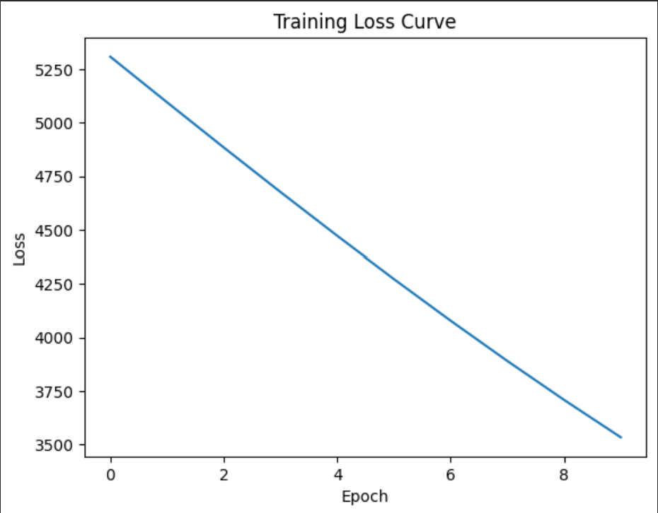
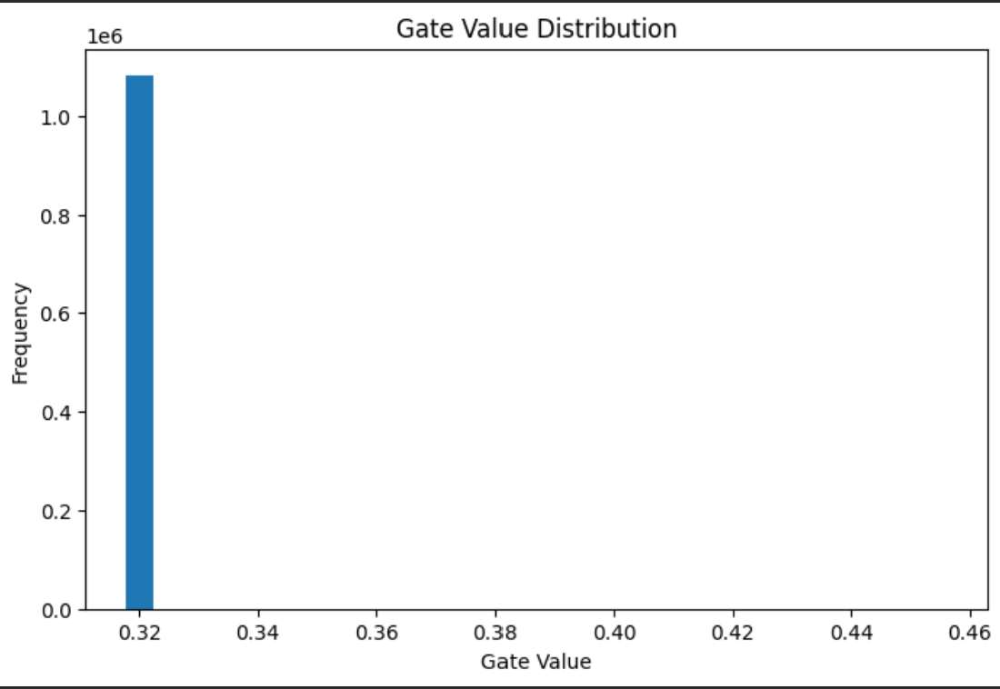

# Self-Pruning Neural Network

A PyTorch-based implementation of a self-pruning neural network that learns to reduce unnecessary connections during training using learnable gate parameters. Instead of performing pruning after training, this model integrates pruning directly into the optimization process.

## Project Objective

Large neural networks often contain redundant parameters, increasing memory usage and computation cost. The objective of this project is to design a network that can automatically suppress less important weights while maintaining classification performance.

## Key Features

- Custom **PrunableLinear** layer with learnable gate scores
- Gate values generated using **temperature-scaled sigmoid activation**
- Effective weights computed as gated weights
- **CNN backbone** for improved CIFAR-10 image feature extraction
- Integrated **sparsity regularization loss**
- End-to-end training using PyTorch
- Performance comparison with fully connected baseline model
- Visualization of training behavior and gate distribution

## Model Architecture

Input Image (32x32 RGB)  
↓  
Conv2D (3 → 32) + ReLU + MaxPool  
↓  
Conv2D (32 → 64) + ReLU + MaxPool  
↓  
Flatten  
↓  
PrunableLinear  
↓  
PrunableLinear  
↓  
Output Layer (10 Classes)

## Pruning Mechanism

Each trainable weight is associated with a learnable gate:

- Gate score is optimized during training
- Sigmoid converts score into value between 0 and 1
- Final effective weight:

Weight × Gate

If a gate becomes small, the connection contribution is reduced, enabling soft pruning.

## Loss Function

Total training loss combines:

- CrossEntropy Loss (classification accuracy)
- Sparsity Loss (sum of gate activations)

This encourages the model to remain accurate while using fewer effective connections.

## Dataset

**CIFAR-10** image classification dataset with 10 classes:

- Airplane
- Automobile
- Bird
- Cat
- Deer
- Dog
- Frog
- Horse
- Ship
- Truck

## Data Preprocessing

- Random Crop
- Random Horizontal Flip
- Tensor Conversion
- Normalization

## Results

| Model | Accuracy |
|------|----------|
| Fully Connected Baseline | 27.3% |
| CNN + Prunable Head | 49.75% |

### Improvement Achieved

- Significant increase in classification accuracy
- Better feature extraction using convolutional layers
- Successful integration of trainable pruning mechanism

## Training Loss Curve

## Gate Distribution

## Files Included

- Self_Pruning_Neural_Network.ipynb — complete notebook implementation
- report.md — methodology, experiments, and conclusions
- README.md — project overview
- training_loss.png — training performance graph
- gate_distribution.png — learned gate values visualization

## How to Run

1. Open `Self_Pruning_Neural_Network.ipynb` in Google Colab.
2. Enable GPU runtime for faster training.
3. Run all cells sequentially.
4. View final accuracy, sparsity metrics, and generated plots.

## Future Improvements

- Hard threshold pruning for exact zero weights
- Structured neuron/channel pruning
- Dynamic temperature annealing
- Inference speed benchmarking
- Deployment on larger datasets

## Technologies Used

- Python
- PyTorch
- Google Colab
- NumPy
- Matplotlib

## Conclusion

This project demonstrates how neural networks can learn compact representations by reducing unnecessary connections during training. It combines deep learning, regularization, and model compression ideas in a practical implementation.
